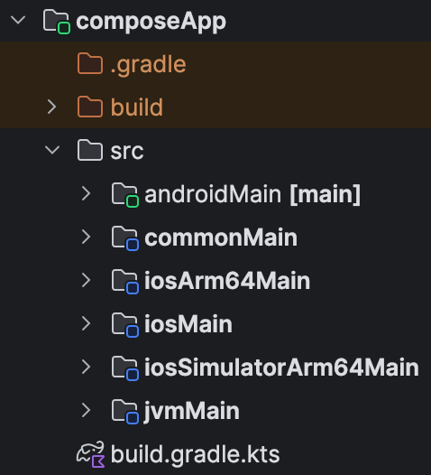
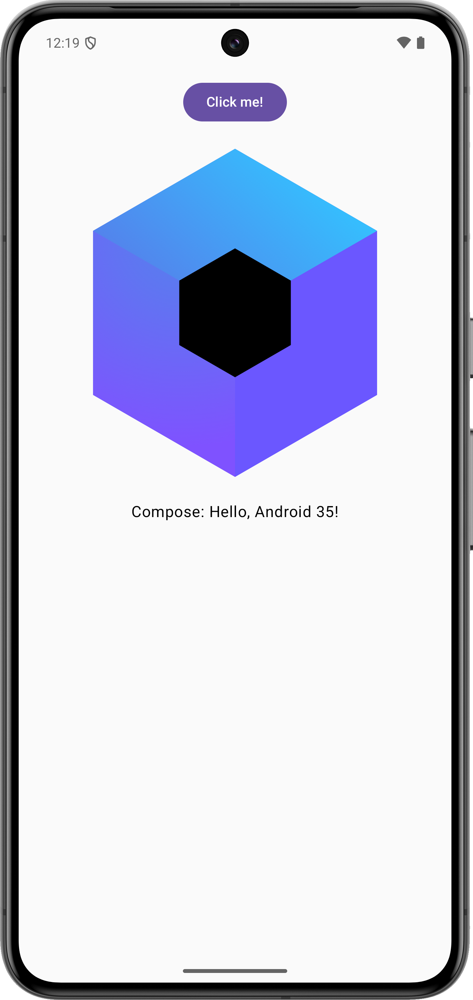
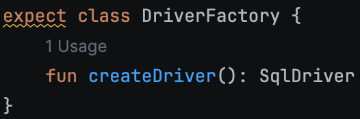
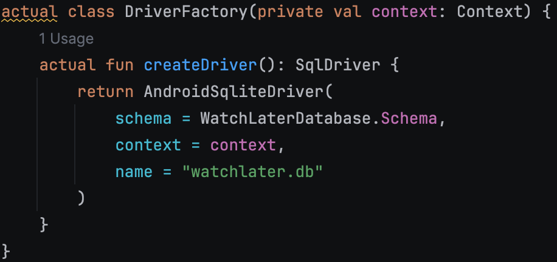
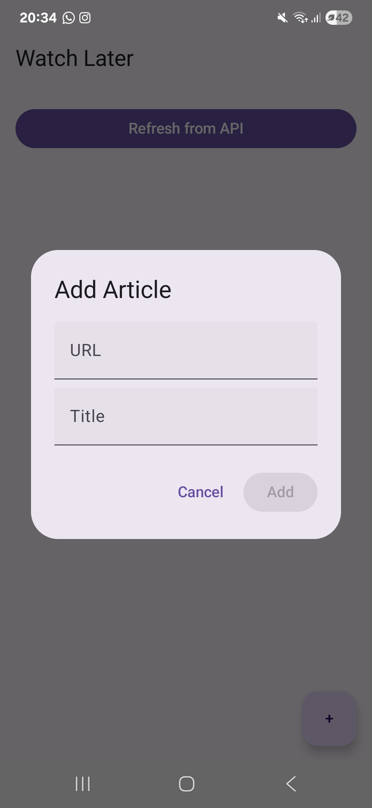

# WatchLater

Cross-platform aplikacija za čuvanje linkova i stranica za kasniji pregled. Aplikacija je razvijena
u Kotlin Multiplatform framework-u uz Store biblioteku za offline-first aplikacije.

## Problem koji odabrana tehnologija rešava

[Kotlin multiplatform](https://kotlinlang.org/docs/multiplatform/kmp-overview.html) rešava problem kreiranja iste aplikacije za više različitih platformi na efikasan 
i intuitivan način. Za razliku od *native* pristupa, kod cross-platform rešenja poput Kotlin Multiplatform-a
se iz jednog source koda dobijaju aplikacije za više podržanih platformi, što značajno olakšava otklanjanje
grešaka (bug-ova), ubrzava razvoj softvera i smanjuje potrebu za sinhronizacijom izgleda i ponašanja
posebnih aplikacija za svaku platformu.

Kako bi što bolje bilo prikazano koliko Kotlin Multiplatform zaista olakšava razvoj softvera, kao i da
već postoji veliki broj biblioteka i dodatnih alata, izabrana je biblioteka [Store](https://store.mobilenativefoundation.org/docs/meet-store) i offline-first paradigma.
Ukratko, offline-first je način razvijanja aplikacije koji omogućava korisnicima da je neometano koriste
bez konekcije sa serverom, a da se podaci sinhronizuju tek kada konekcija bude uspostavljena.

## Kotlin Multiplatform

### Struktura fajlova

Glavni pristup je smanjenje specijalnog koda za različite platforme, ali da ta mogućnost ostaje otvorena.
Source file-ovi su podeljeni u foldere u zavisnosti od toga za koju su platformu namenjeni, a postoji
i commonMain folder koji sadrži fajlove koji su zajednički za sve platforme.

Za svaku platformu postoji zaseban *entry point*, tako je za Android to MainActivity.kt, za iOS je MainViewController.kt,
za JVM (desktop aplikacije ili druge platforme koje podržavaju JVM) je to main.kt. Takođe je podržano i
razvijanje aplikacija za web, bilo uz pomoć React-a za UI ili deljenog UI dela. KMP podržava i Kotlin/JS
koji se pokreće na JavaScript engine-u, ali i noviji Kotlin/Wasm koji radi na WebAssembly engine-u.

### Compose Multiplatform

[Compose Multiplatform](https://kotlinlang.org/docs/multiplatform/compose-multiplatform.html) je deklarativni
višeplatformski framework za UI koji koristi Kotlin. Deklarativan znači da se UI razvija kao hijerarhija
komponenti i opisuje se kako koja komponenta treba da izgleda i ponaša se. Compose Multiplatform se
često koristi uz Kotlin Multiplatform i ima smisla koristiti ga jer prate iste principe i dodatno smanjuju
dupliranje koda ili potrebu za različitim načinima razvoja UI za svaku platformu. Naravno, ta mogućnost
i dalje postoji, tako je, na primer, moguće koristiti Kotlin Multiplatform i Compose Multiplatform za
sve platforme, ali UI za iOS aplikaciju praviti sa SwiftUI framework-om, ili je moguće koristiti React
za web kao što je ranije pomenuto.

### expect-actual

Sistem koji je nedavno uveden kako bi se još više pojednostavilo upravljanje delovima koda koji se razlikuju
za različite platforme. U common kodu je moguće deklarisati klase sa ključnom rečju expect, čime se
nalaže da se očekuje da svaka platforma ima implementiranu tu klasu na svoj način i ona se u common kodu
može koristiti kao interfejs. U platform-specific kodu se koristi actual ključna reč da bi naglasila
da se radi o implementaciji te klase za tu konkretnu platformu.

U ovom projektu je to korišćeno za DriverFactory. Za lokalno skladištenje podataka je korišćena
biblioteka [SQLDelight](https://sqldelight.github.io/sqldelight/latest/) koja olakšava pristup bazi
podataka sa različitih platformi i generiše potrebne fajlove na osnovu SQL query-ja. U kodu se može videti zajednička expect klasa DriverFactory.kt koja
omogućava pisanje samo jednog koda za pristup bazi koji se povezuje sa Store-om. Sa druge strane, svaka
platforma ima svoj DriverFactory (DriverFactory.android.kt na primer) koji na drugačiji način pristupa
bazi. U build fajlovima je takođe podešeno dodavanje različitih verzija sqldelight biblioteke kako za
različite platforme, ali će o tome biti više reči kasnije.

### Build fajlovi

Kotlin Multiplatform nudi dve opcije za build language, to su Gradle DSL, koji se preporučuje, i Groovy DSL.
U ovom projektu je korišćen Gradle. Upravljanje build procesom se vrši kroz build.gradle.kts fajl, koji
omogućava dodavanje biblioteka i plugin-ova, grupisanje u biblioteke, ali i kompleksnije build skripte.
Primer build scripte se ovde može videti i u build.gradle.kts fajlu na nivou aplikacije gde skripta dodaje
posebne bibilioteke u build proces u zavisnosti od platforme za koju se projekat trenutno pokreće.

Od skoro gradle koristi poseban libs.versions.toml fajl za lakše upravljanje verzijama biblioteka,
nalik na lock fajlove u drugim tehnologijama (npr. package-lock.json ili Gemfile.lock).
Ovaj fajl takođe omogućava grupisanje u custom biblioteke kako bi importovi i upravljanje verzijama
bili čistiji.

## Store biblioteka

Store je deo mobile foundation grupe projekata i dosta je često korišćen u industriji za upravljanje
tokom podataka u aplikaciji ili većim sistemima. Za ovaj projekat je izabran kako bi demonstrirao kako
se eksterne postojeće biblioteke prilagođavaju Kotlin Multiplatform ekosistemu i kako podržavaju rad
sa više platformi. Ova biblioteka je u potpunosti kompatibilan sa Kotlin korutinama koje su moderan
i efikasan način za rad sa više niti i brže su od standardnih JVM niti.

Store ima nekoliko osnovnih koncepta koje je potrebno shvatiti kako bi se sve koristilo na prikladan
i zamišljen način. Store je repository (pattern), jako tipiziran i posreduje između memorije, diska i
mrežnih podataka. Source of truth je izvor podataka koji se smatra važećim i tačnim, u ovom slučaju je
to lokalna baza podataka što aplikaciju čini offline-first aplikacijom. Fetcher je komponenta koja definiše
kako će se podaci preuzimati sa servera, updater kako će se slati na server, a bookkeeper vodi računa
o stanju podataka i sinhronizaciji. Takođe postoje i validator koji vodi računa o tome da su svi podaci
validni i da li ih treba refreshovati, kao i konverter koji pretvara podatke u oblik koji odgovara
komponenti kojoj su potrebni.

## Funkcionalnosti aplikacije

Aplikacija omogućava
- dodavanje linkova za kasniji pregled (Artikl)
- označavanje linkova kao pročitanih
- ažuriranje liste sa mock API requestom
- lokalna perzistencija

## Lista korišćenih tehnologija

- [Kotlin Multiplatform](https://kotlinlang.org/docs/multiplatform/kmp-overview.html)
- [Compose Multiplatform](https://kotlinlang.org/docs/multiplatform/compose-multiplatform.html)
- [Store](https://store.mobilenativefoundation.org/docs/meet-store)
- [SQLDelight](https://sqldelight.github.io/sqldelight/latest/)

## Pokretanje

Preporučuje se korišćenje Android Studio razvojnog okruženja sa Kotlin Multiplatform plugin-om (ili IntelliJ
sa istim plugin-om). Potreban je gradle za pokretanje projekta, builduje se komandom
`./gradlew build`
a pokreće se komandom
`./gradlew task`
gde je task:
- za Android platformu je androidApp:run
  - potrebno je instalirati adb za povezivanje sa uređajima ili Android emulator
- za iOS platformu je embedAndSignAppleFrameworkForXcode
  - potrebno je instalirati xcode i pokrenuti na macOS uređaju
- za JVM/desktop platformu je composeApp:run
  - potrebno je instalirati JVM

